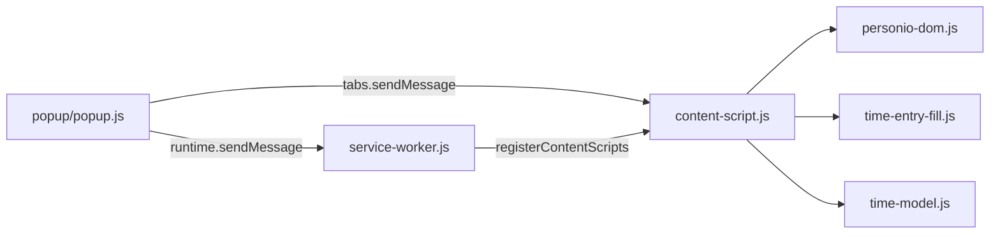

# Personio Attendance Autofill

Chrome extension (Manifest V3) that fills **empty, editable** days on your Personio **monthly attendance** timesheet using a configurable **Work → Break → Work** schedule.

**Not affiliated with Personio.** Use according to your employer’s time-tracking policies. You remain responsible for reviewing and submitting timesheets in Personio.

## Features

- **Auto fill empty days** — walks unfilled rows from day 1 through end of month and applies your default schedule
- **Per-day clear** — remove all periods for one calendar day (with confirmation)
- **Scoped access** — runs only on your configured `*.app.personio.com` subdomain and employee attendance URL
- **Row-aware** — skips approved, locked, and non-editable rows; does not overwrite tracked days
- **Activity log** — step-by-step output in the popup while commands run

## Requirements

- Google Chrome (or Chromium) with extension support
- Personio account with attendance / time tracking
- Monthly attendance view for your employee record

## Installation (development)

1. Clone this repository.
2. Open `chrome://extensions`.
3. Enable **Developer mode**.
4. Click **Load unpacked** and select the repository root (the folder containing `manifest.json`).

## Usage

### 1. Configure account

Open the extension popup (**Personio Autofill**).

| Field | Where to find it |
|--------|------------------|
| **Company subdomain** | From `https://**your-company**.app.personio.com/...` — enter `your-company` only |
| **Employee ID** | Numeric ID in the attendance URL path: `/attendance/employee/**12345678**` |

Click **Save settings**. Chrome will ask for permission to access **only your company’s** Personio host (`https://your-company.app.personio.com/*`). Other Personio tenants are not granted.

### 2. Set work schedule

| Field | Meaning |
|--------|---------|
| **Start / End** | Work block boundaries (24h `HH:MM`) |
| **Break (minutes)** | Break length between the two work blocks |

Schedule is stored in `chrome.storage.sync` (if sync is enabled). Account fields use `chrome.storage.local`.

### 3. Auto fill

1. Open Personio → **Attendance** → **monthly** view for the current month (or let the extension navigate the active tab).
2. Wait until the day grid is visible (use **Refresh** on Personio if the empty state appears).
3. Click **Auto fill empty days**.

The extension fills each candidate day with **Work → Break → Work**, clicks **Save** in Personio, and verifies tracked time &gt; 0. Progress appears under **Activity**.

### 4. Clear one day

1. Enter the **day of month** (1–31).
2. Click **Clear** and confirm.

Removes periods for that day on the open monthly sheet. Does not run on approved or locked rows.

## What gets filled (and what does not)

**Filled** when the row is an editable empty candidate (0h tracked, not approved/locked).

**Skipped** when the row is already tracked, approved, locked, pending in a non-editable state, or outside the monthly grid.

**Page guard** — commands only run when:

- URL is `https://{your-subdomain}.app.personio.com/attendance/employee/{your-id}`
- Query includes `viewMode=monthly`
- Subdomain and employee ID match saved settings

## Permissions

| Permission | Why |
|------------|-----|
| `storage` | Subdomain, employee ID, schedule |
| `tabs` | Open or focus the attendance tab |
| `scripting` | Register content scripts for your Personio host |
| `optional_host_permissions` | Access your company Personio origin after you approve it |

No remote servers, analytics, or credentials are handled by the extension.

## Project layout

```
manifest.json           # Extension manifest
background/
  service-worker.js     # Content-script registration, host permissions
popup/                  # Toolbar popup UI
src/
  personio-config.js    # URL/subdomain helpers
  personio-dom.js         # DOM parsing, row classification
  time-model.js           # Work–break–work period math
  time-entry-fill.js      # Form filling
  spin-fill.js            # Time spin controls
  safety.js               # Page guards, polling
  content-script.js       # AUTO_FILL / REVERT_DAY handlers
test/                     # Node unit tests (DOM/model)
tests/                    # Browser console pretest bundle
store/                    # Chrome Web Store zip + marketing screenshots
icons/                    # Extension icons
```

## Development

### Unit tests

```bash
npm test
```

Covers config normalization, DOM classification, time model, and fill-candidate logic (no browser).

### Manual pretest on Personio

See [tests/README.md](tests/README.md). Build the console bundle and run flows on a real monthly attendance page before shipping DOM changes.

```bash
npm run pretest:build
```

### Reload after code changes

1. `chrome://extensions` → **Reload** on this extension.
2. Reload the Personio attendance tab (content scripts re-inject on navigation).

If commands stop responding after changing subdomain, click **Save settings** again.

## Chrome Web Store package

From the repo root:

```bash
./store/generate_zip.sh
```

Produces `store/personio-store.zip` containing only runtime files (`manifest.json`, `background/`, `src/`, `popup/`, `icons/`). Do not include `test/`, `tests/`, or `store/` in the upload zip.

### Store screenshots

Place raw popup captures in `store/source/` as `settings.png` and `actions.png`, then:

```bash
python3 -m venv .venv-store
.venv-store/bin/pip install pillow
.venv-store/bin/python3 store/build-screenshots.py
```

Output: `store/assets/*` at 1280×800, 640×400, and optional promo sizes for the listing.

## Architecture (brief)



1. **Popup** validates settings, ensures host permission, opens the correct monthly URL, sends `AUTO_FILL` or `REVERT_DAY`.
2. **Service worker** registers content scripts for `https://{subdomain}.app.personio.com/attendance/employee/*` after install or settings change.
3. **Content script** loads canonical settings from storage (never trusts message payload for host binding), asserts page location, scans rows, drives the Personio UI.

## Troubleshooting

| Symptom | Try |
|---------|-----|
| “No response from content script” | Save settings, reload attendance tab |
| “Timesheet not loaded” | Open monthly view, click Personio **Refresh**, retry |
| “Host permission … not granted” | Save settings again and allow the subdomain prompt |
| Validation modal after save | Fix conflicts in Personio for that day, or use **Clear** |
| Wrong month | Extension targets the **current calendar month** (`startDate=YYYY-MM-01`) |

## License

Private / unpublished unless otherwise noted by the repository owner.
